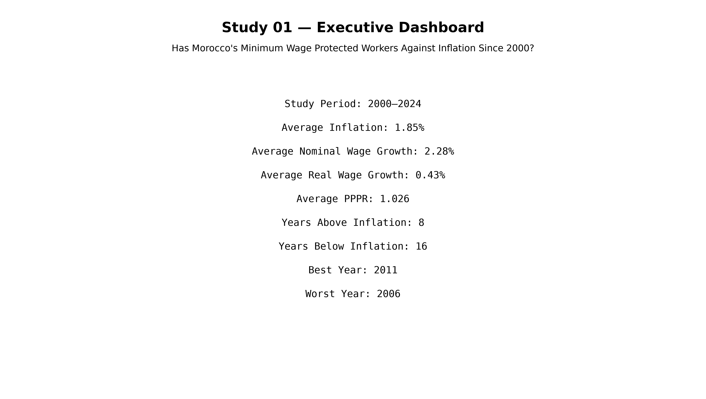
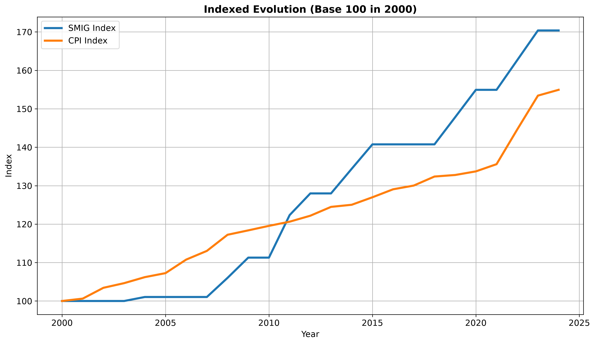
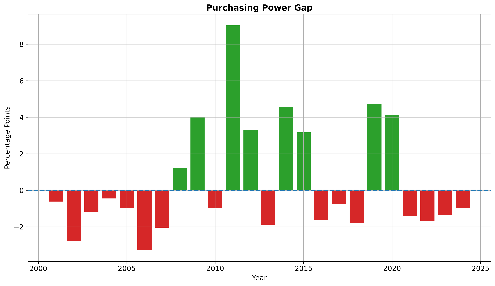
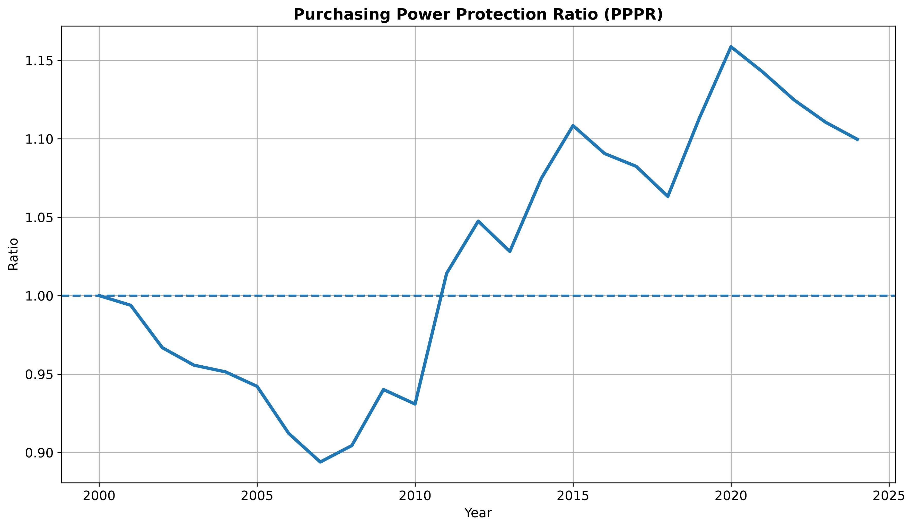
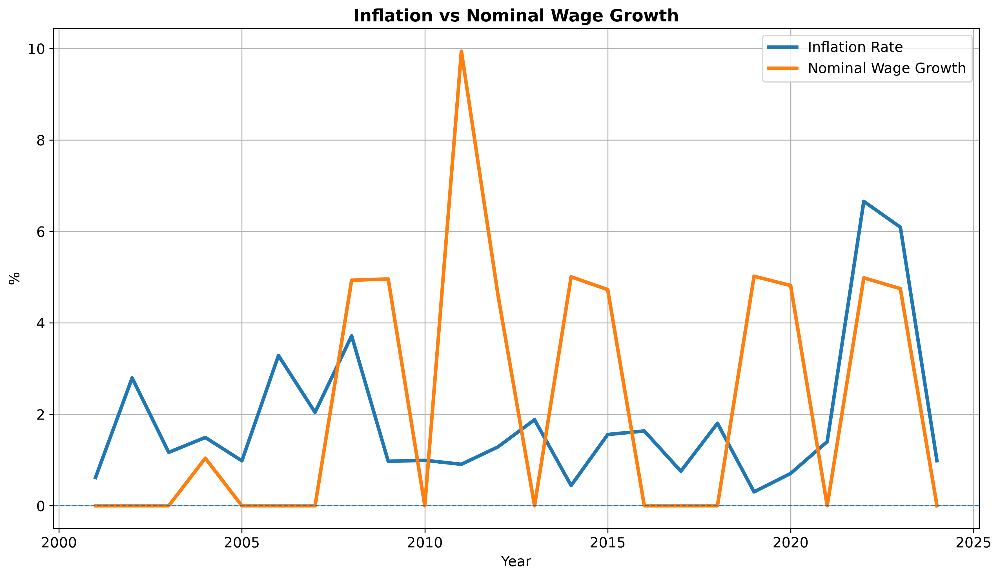
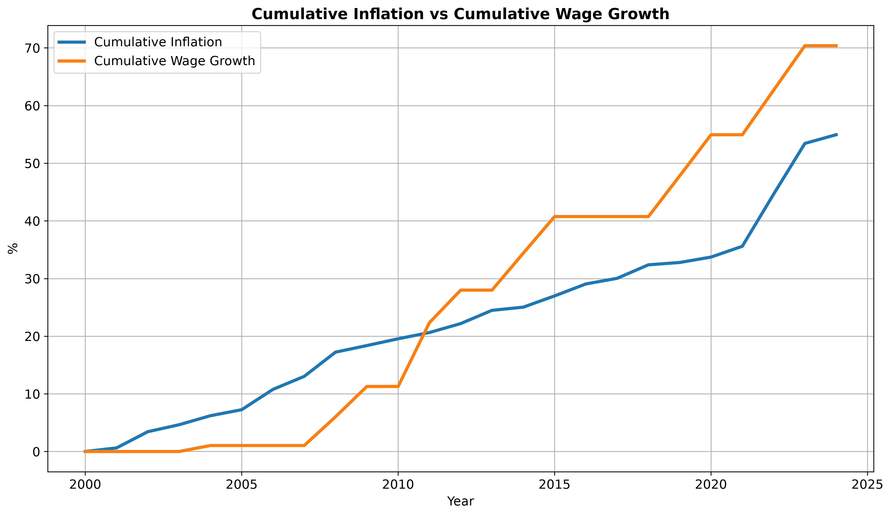
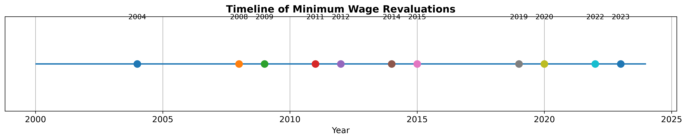
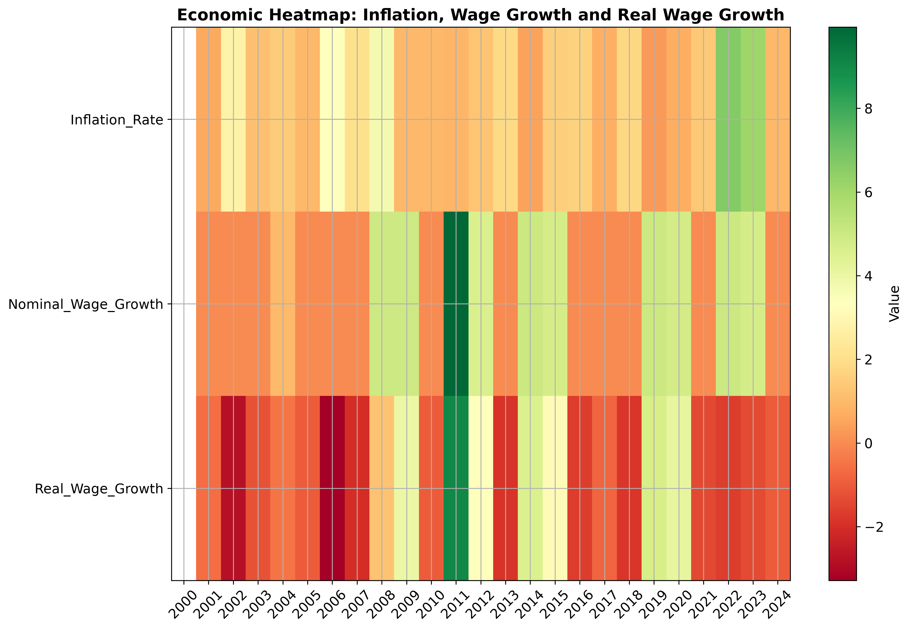

# Study 01 — Executive Summary

## Has Morocco's Minimum Wage Protected Workers Against Inflation Since 2000?

### Morocco Economic Intelligence Lab (MEIL)

## Executive Summary

This study examines whether Morocco's statutory minimum wage protected workers
against inflation over the period 2000-2024.

The analysis shows an average annual inflation rate of 1.85%, 
compared with an average nominal minimum wage growth rate of 
2.28%.

The average real wage growth rate was 0.43%, while the
average Purchasing Power Protection Ratio (PPPR) stood at 1.026.

The minimum wage outpaced inflation in 8 years, while inflation
outpaced the minimum wage in 16 years. In 0 years, both
grew at the same pace.

The best year for purchasing power was 2011, with a gap
of 9.03 percentage points.

The worst year for purchasing power was 2006, with a
gap of -3.28 percentage points.

Over the full period, the statutory minimum wage increased faster than consumer prices in cumulative terms.

## Key Findings

- Inflation outpaced the minimum wage in more years than the minimum wage outpaced inflation.
- The cumulative real wage performance remained positive over the full 2000–2024 period.
- On average, the minimum wage protected purchasing power better than inflation eroded it.
- The strongest purchasing-power gain occurred in 2011.
- The weakest purchasing-power outcome occurred in 2006.

## Statistical Highlights

| Indicator                          | Value     |
|:-----------------------------------|:----------|
| Study period                       | 2000-2024 |
| Observations                       | 25        |
| Average inflation rate (%)         | 1.85      |
| Average nominal wage growth (%)    | 2.28      |
| Average real wage growth (%)       | 0.43      |
| Average PPPR                       | 1.026     |
| Years above inflation              | 8         |
| Years below inflation              | 16        |
| Years equal to inflation           | 0         |
| Best year                          | 2011      |
| Worst year                         | 2006      |
| Cumulative nominal wage growth (%) | 70.37     |
| Cumulative inflation (%)           | 54.94     |
| Cumulative real gain (%)           | 15.44     |

## Decade Comparison

|   Decade |   Average Inflation (%) |   Average Nominal Wage Growth (%) |   Average Real Wage Growth (%) |   Average PPPR |
|---------:|------------------------:|----------------------------------:|-------------------------------:|---------------:|
|     2000 |                    1.9  |                              1.21 |                          -0.68 |           0.95 |
|     2010 |                    1.16 |                              2.93 |                           1.77 |           1.06 |
|     2020 |                    3.17 |                              2.91 |                          -0.26 |           1.13 |

## Best and Worst Years

| Type       |   Year |   Purchasing Power Gap |   Real Wage Growth |
|:-----------|-------:|-----------------------:|-------------------:|
| Best year  |   2011 |                   9.03 |               9.03 |
| Worst year |   2006 |                  -3.28 |              -3.28 |

## Figures

### figure_01_executive_dashboard.png

### figure_02_base100_comparison.png

### figure_03_purchasing_power_gap.png

### figure_04_pppr.png

### figure_05_inflation_vs_wage_growth.png

### figure_06_cumulative_growth.png

### figure_07_revaluation_timeline.png

### figure_08_economic_heatmap.png

## Conclusion

The analysis indicates that Morocco's statutory minimum wage generally kept pace with inflation over the full study period, but the protection of purchasing power was uneven across years.

## Limitations

- The minimum wage is only a proxy for workers at the lower end of the formal labour market.
- The analysis does not capture informal employment dynamics.
- CPI measures average price changes and may differ from the consumption basket of individual households.
- The study is annual and does not capture intra-year timing effects of wage adjustments and price shocks.

## Future Work

- Compare the minimum wage with other wage benchmarks.
- Extend the analysis to sectoral wages and household income measures.
- Add a regional dimension when data become available.